<div align="center">

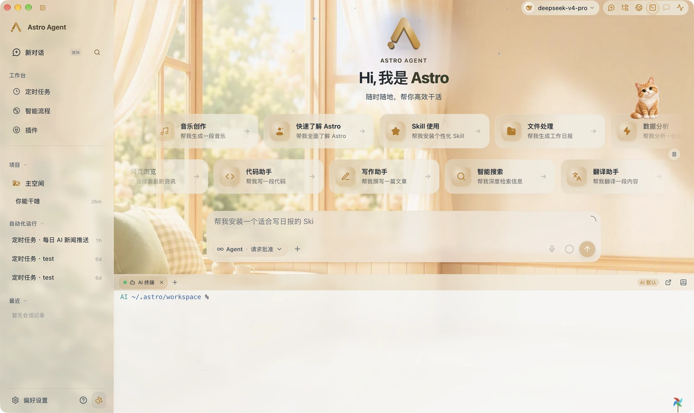

# Astro Agent（阿童木）

**本地优先的多模态 AI 桌面工作站**：Rust 内核 · Tauri 2 外壳 · React 界面


</div>

> **说明**：本仓库只发布 Astro Agent 的**文档与界面截图**，源代码不在此仓库公开。

## 目录

- [这是什么](#这是什么)
- [Agent = Model + Harness](#agent--model--harness)
- [界面速览](#界面速览)
- [功能模块](#功能模块)
  - [对话与 Agent 运行时](#1-对话与-agent-运行时)
  - [交互控制、审批与权限](#2-交互控制审批与权限)
  - [模型接入、模型市场与 Provider](#3-模型接入模型市场与-provider)
  - [工具、Skills 与 MCP](#4-工具skills-与-mcp)
  - [定时任务与可视化工作流](#5-定时任务与可视化工作流)
  - [记忆、工作区与文件空间](#6-记忆工作区与文件空间)
  - [用量洞察与可观测性](#7-用量洞察与可观测性)
  - [内置浏览器与终端](#8-内置浏览器与终端)
  - [外观、氛围与桌宠](#9-外观氛围与桌宠)
  - [环境依赖、诊断与存储](#10-环境依赖诊断与存储)
- [架构总览](#架构总览)
- [快速开始](#快速开始)
- [打包与发布](#打包与发布)
- [运行形态](#运行形态)
- [本机数据目录](#本机数据目录)
- [README 截图如何维护](#readme-截图如何维护)
- [文档索引](#文档索引)
- [常用命令](#常用命令)
- [许可证](#许可证)

## 这是什么

Astro Agent（中文名「阿童木」）是一款跑在本机的 AI Agent 桌面应用。它不是浏览器里的聊天框，而是一个把 **模型 + 工具 + 记忆 + 文件 + 自动化** 装进同一套进程的工作站。

- **Agent 运行在本地进程内**：Rust 内核负责 Agent 循环、工具路由、沙箱与持久化；Tauri 壳默认以同进程方式启动 backend，双击 App 即可对话，无需另开终端。
- **数据留在本机**：会话、记忆、文件索引、用量与安全审计写入 `~/.astro`，SQLite（WAL + FTS5）与 append-only rollout 是唯一事实源。
- **模型可换、可回退**：内置 17 种 Provider 接入（含自定义 OpenAI 兼容端点），主模型在首个 token 前失败会自动切换到备用目标链；辅助任务（标题、压缩、审批、入梦）可单独指定模型。
- **能力靠工具与 Skill 扩展**：终端、文件、代码执行、浏览器、记忆、子 Agent、图像 / 视频 / 语音生成等工具按 Agent 与交互模式动态装载，MCP Server 与 Skill 包即插即用。
- **不静默越权**：危险命令、网络与文件写入按权限 profile 走沙箱与人工审批，全部动作可审计。

### 关键特性一览

| 主题 | 说明 |
| --- | --- |
| 对话 | Responses-only Agent 循环、原生 `ResponseItem` 历史、多轮工具调用、流式输出、上下文压缩与检查点续接 |
| 模型 | 17 种 Provider 接入、模型市场与 OpenRouter 目录曲线、推理档位切换、辅助模型独立路由 |
| 工具 | 内置工具注册表、三级暴露策略与 BM25 检索、危险命令分类与审批、大结果落盘（tool spill） |
| 扩展 | Skills（本机 / 商店）、MCP（stdio / Streamable HTTP）、Hooks 三总线、Extension Manifest |
| 自动化 | Cron 定时任务、43 类节点的可视化工作流、Webhook 触发、Subagent 线程协作 |
| 记忆 | MEMORY.md / USER.md 精炼记忆、Dreaming 入梦、待审批记忆队列、线程检查点与历史回读 |
| 桌面 | 系统托盘常驻、桌面宠物、壁纸与氛围、内置浏览器与终端、Realtime 语音会话、中英双语 |
| 安全 | 平台原生沙箱（Seatbelt / bubblewrap / Job Object）、受管网络代理、append-only 审计日志 |

## Agent = Model + Harness

模型只负责「想」，其余全在 Harness 里。同一个模型放进不同质量的 Harness，表现可以差一个量级：**Astro Agent 的产品定位，就是把 Harness 做完整。**

```text
Agent = Model + Harness

  Model            只负责推理与生成

  Harness
   ├── Loop          执行循环：推理 → 行动 → 观察，直到完成 / 中断 / 耗尽
   ├── Context       上下文与记忆：决定模型每一步能看见什么
   ├── Tools         工具中介：把意图翻译成受控的真实执行
   ├── Safety        权限与安全：审批、沙箱、路径与网络边界
   ├── Recovery      错误与恢复：超时、取消、fallback、崩溃重启
   ├── Observability 可观测与审计：事件、用量、成本、审批与拒绝
   └── Environment   运行环境：终端、浏览器、MCP、媒体、Cron、工作流、桌宠
```

七个维度在本项目里的落点：

| Harness 维度 | 含义 | 落点 |
| --- | --- | --- |
| **Loop** | 执行循环：推理 → 行动 → 观察，直到完成 / 中断 / 耗尽 | `AstroThread → SessionTask → TurnContext → StepContext`；一次 Step 冻结 provider / model / 工具路由，单条消息默认 90 轮工具预算，随时可中断、可续接 |
| **Context** | 上下文与记忆：决定模型每一步能看见什么 | 三层 Prompt（稳定指令 / 动态上下文 / 原生工具 schema）、FTS5 召回、prune→摘要→head/tail 三阶段压缩、线程检查点 `notes`、MEMORY.md / USER.md 与 Dreaming |
| **Tools** | 工具中介：把意图翻译成受控的真实执行 | `ToolRegistry` + 三级暴露 + BM25 检索；内置终端 / 文件 / 代码执行 / 浏览器 / 记忆 / 子 Agent / 媒体工具，MCP 与 Skills 按轮热加载 |
| **Safety** | 权限与安全：审批、沙箱、路径与网络边界 | 三级权限画像、Seatbelt / bubblewrap / Job Object 平台沙箱、受管 CONNECT 代理与 DNS 重绑定防护、危险命令分类与审批、append-only 审计 |
| **Recovery** | 错误与恢复：超时、取消、fallback、崩溃重启 | 首个 token 前的模型 fallback 链、工具超时与取消、结构化拒绝分类（不误升级权限）、rollout + 检查点跨重启续接 |
| **Observability** | 可观测与审计：事件、用量、成本、审批与拒绝 | 统一 `EventMsg` → rollout → gRPC/Tauri 投影的单一事件流，用量事件库与成本估算、调用链 Tracing、安全审计日志 |
| **Environment** | 运行环境：终端、浏览器、MCP、媒体、Cron、工作流、桌宠 | PTY 终端与浏览器停靠、MCP 进程池、图像 / 视频 / 音频 / 语音生成与理解、Cron 定时任务与 43 类节点工作流、桌面宠物与壁纸氛围 |

设计与契约见 [Agent Harness 总体架构](docs/03-系统设计阶段/01-架构设计/11-Agent-Harness总体架构.md)，代码级契约见 [Agent Harness 执行外壳详细设计](docs/04-详细设计阶段/01-核心引擎层/14-Agent-Harness执行外壳详细设计.md)。

## 界面速览

主界面左侧是导航与任务侧栏（会话、项目、定时任务、工作流、插件），中间是对话流，底部 Composer 负责模型选择、交互模式、审批策略与附件；右上角工具栏可以随时打开文件、终端、浏览器等停靠面板。

> 本文截图均截取自运行中的 Astro Agent 桌面端真实窗口（含真实壁纸、桌宠与本地工作区），不是设计稿。

## 功能模块

### 1. 对话与 Agent 运行时


- **Responses-only 主链路**：Agent 请求统一走 Responses API，历史就是原生 `ResponseItem`；`AstroThread → SessionTask → TurnContext → StepContext` 逐层收窄一次 Step 的模型、工具与预算。
- **回合时间线**：思考、工具调用、命令输出、引用、token 用量与缓存命中率都作为 Thread item 投影到桌面端，可逐条展开。
- **多轮工具循环**：`tool_rounds` 每条用户消息重置，单条消息默认最多 90 轮；`code_exec` 独占轮可退还预算。
- **上下文管理**：prune → 辅模型摘要 → head/tail fallback 三阶段压缩，原文永久保留、Provider 视图使用压缩视图，并带 thrashing guard 防抖。
- **续接与恢复**：线程检查点（`notes`）+ 历史回读（`history`）让长任务可跨重启继续；rollout 文件是事实源，SQLite 可由 rollout 重建。
- **模型回退**：首个 chunk 前失败自动切换备用模型目标；主模型与五类辅助任务各自拥有独立目标链。

Composer 上方的用量浮层可以随时拆解当前上下文占用（会话消息、工具定义、系统提示词、Skills、记忆各自的 token 与缓存命中），并给出本轮费用结余：

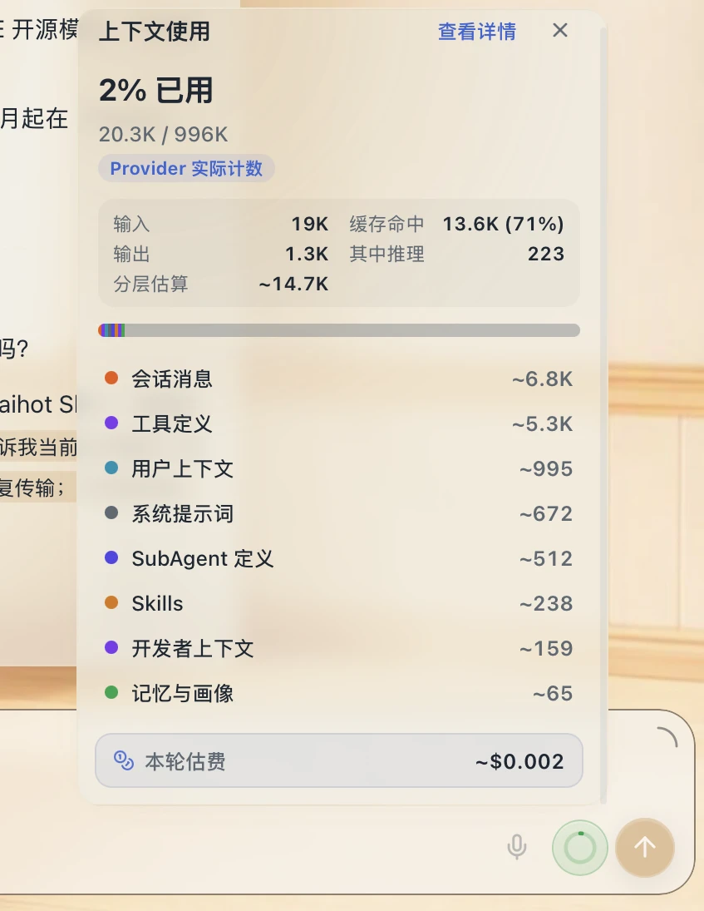

### 2. 交互控制、审批与权限

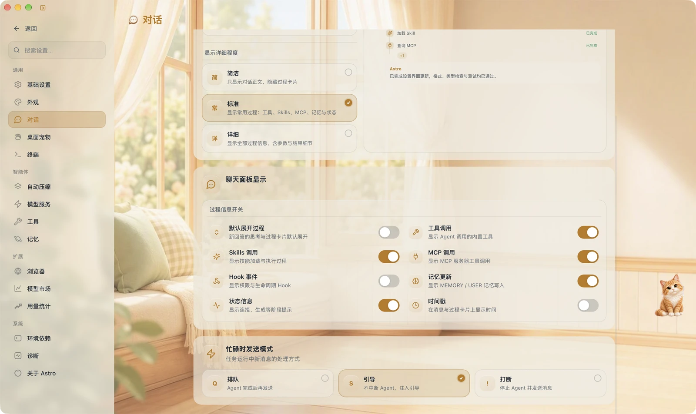

- **按需审批**：危险命令、越界写入与未覆盖网络目标会弹出审批卡（本次允许 / 始终允许同类 / 拒绝），也可以选择让 Agent 在回合中发起结构化提问。
- **生成式 UI（A2UI）**：Agent 可用 `astro://a2ui/catalog/v2` 的 22 种组件推送卡片、表单、澄清向导等结构化界面，而非纯文本。
- **权限画像**：`ReadOnly` / `WorkspaceWrite` / `DangerFullAccess` 三级模型决定可写目录与命令沙箱模式，权限变更与授权事件写入 append-only 审计日志。
- **桌宠弹窗**：桌宠可见时，审批与提问可以在独立弹窗里就地处理，不需要切回主窗口。
- **交互模式**：Agent / Plan 模式按 `InteractionMode` 过滤可用工具 schema；行为说明只进 Responses `instructions`，不污染用户消息。
- **显示与并发偏好**：过程信息（思考过程、技能调用、工具标签、MCP 调用、Hook 事件、记忆更新、时间戳）可逐项开关；任务忙碌时的后续输入可按「排队 / 引导（steer）/ 打断」处理。

### 3. 模型接入、模型市场与 Provider

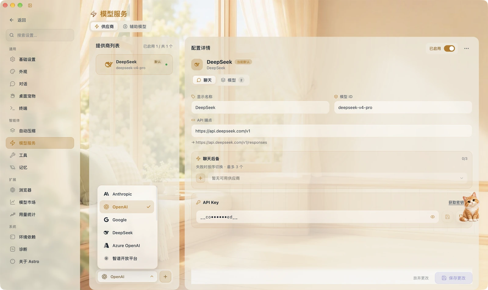

- **17 种 Provider 接入**：OpenAI、Azure OpenAI、Anthropic、Google（含 Gemini Native）、DeepSeek、智谱、月之暗面、OpenRouter、MiniMax、火山引擎、混元、NVIDIA、百炼、Ollama 以及自定义 OpenAI 兼容端点。
- **凭证托管**：API Key 存系统 keyring 或 `.env`，配置统一落在 `~/.astro/config.toml`，写入走同一文件锁与分段更新。
- **模型目录与能力标记**：本地缓存模型元数据与定价；只有声明 Responses 能力的 Provider 才会被 Agent 主链路使用。
- **辅助模型**：标题生成、上下文压缩、智能审批、入梦与记忆回顾可以分别绑定到更便宜或更快的模型。

对话区右上角的模型选择器按 Provider 分组切换模型与推理档位：

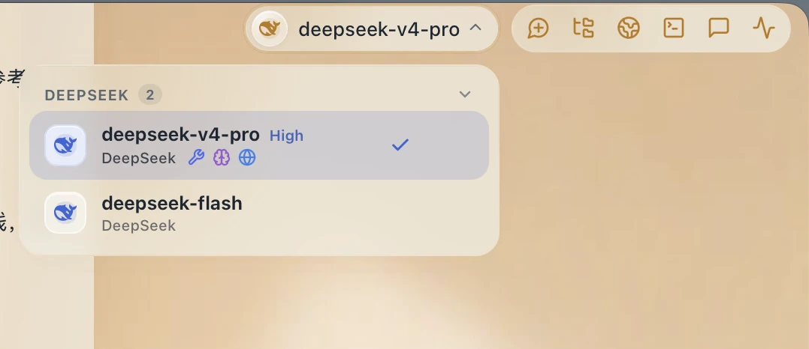

模型市场把「能买什么」摊开：模型卡片带上下文长度、价格与延迟，另有 OpenRouter 目录曲线、任务与模型排行、语音与视觉模型，以及按编码 Agent（Claude Code、Codex、Cline 等）统计的用量折扣参考。

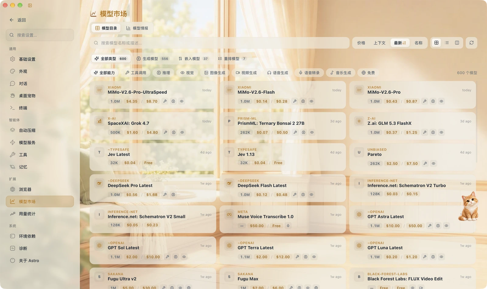

### 4. 工具、Skills 与 MCP

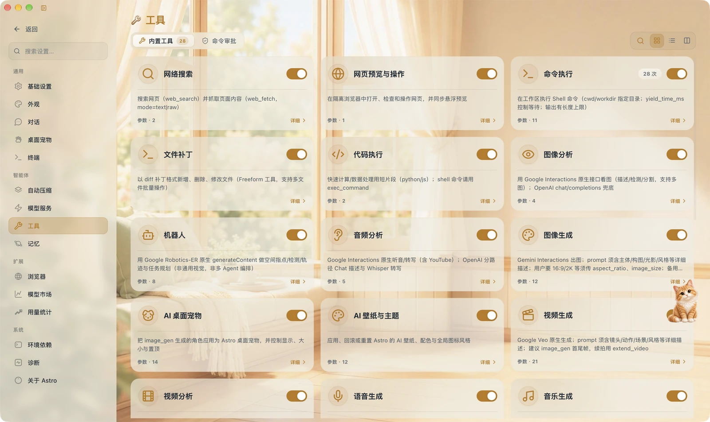

- **内置工具域**：终端与 PTY、文件读写与 `apply_patch`、代码执行、页面浏览、记忆与上下文、子 Agent、待办与计划、图像 / 视频 / 音频 / 语音生成与理解、桌面宠物与 UI 风格等。
- **工具注册表**：`inventory` 自注册 + 统一 `ToolRegistry::dispatch`；schema 清洗、路径安全解析、命令 allowlist / hardline 阻断与沙箱审计元数据统一在分发层完成。
- **开关与审批**：工具可按 Agent 启用/禁用并查看参数规模；「命令审批」独立成页，危险命令规则与豁免都在这里维护。

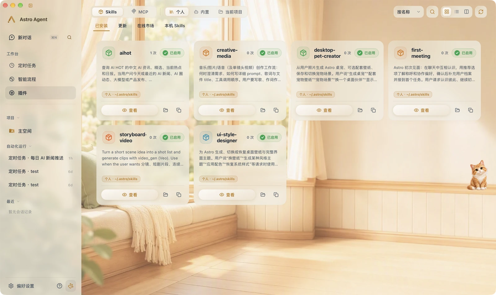

- **Skills**：扫描 `~/.astro/skills/` 与 Agent 级目录的 `SKILL.md`，支持商店安装、版本更新、快照回滚、用量统计；Skill frontmatter 的 `astro_tools` 可 additive 开放工具集。
- **MCP**：stdio 与 Streamable HTTP 两种传输、进程级连接池、自动重连、OAuth 凭据、Server 工具发现与调用；模型侧看到 `mcp__{server}` 命名空间，内部保留 `mcp__{server}__{tool}` 执行键。
- **Hooks**：Plugin / Command / Gateway / Shell 四类执行面覆盖 `PreToolUse`、`PostToolUse`、`PreLlmCall`、`TransformToolResult` 等事件，可拦截、修改或注入上下文。

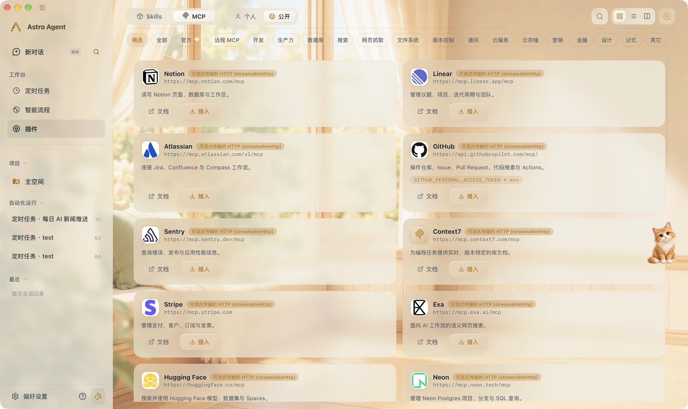

### 5. 定时任务与可视化工作流

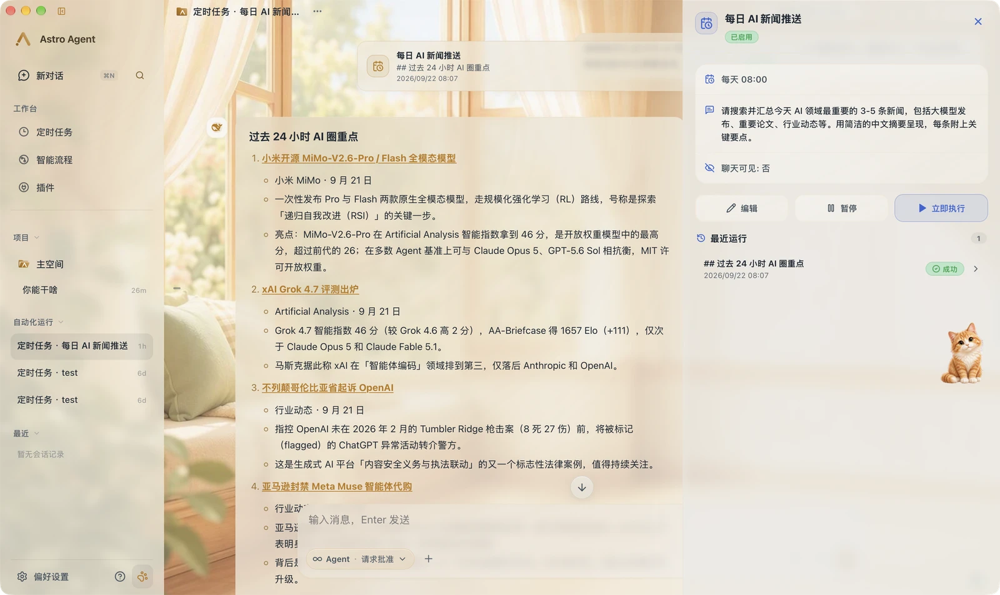

- **调度语法**：支持 `every:Nunit`（可叠加工作日过滤）、`custom:` 日历重复（小时 / 天 / 周 / 月 / 年）与五段 cron。
- **稳定相位**：按本地墙钟记录起始相位，编辑或重启不会让「每 N 天」重新按 epoch 对齐。
- **运行记录**：每次触发写入 `cron_v1.db`，任务完成、失败与需要确认时推送系统通知；ticker 每 30 秒认领到期任务。

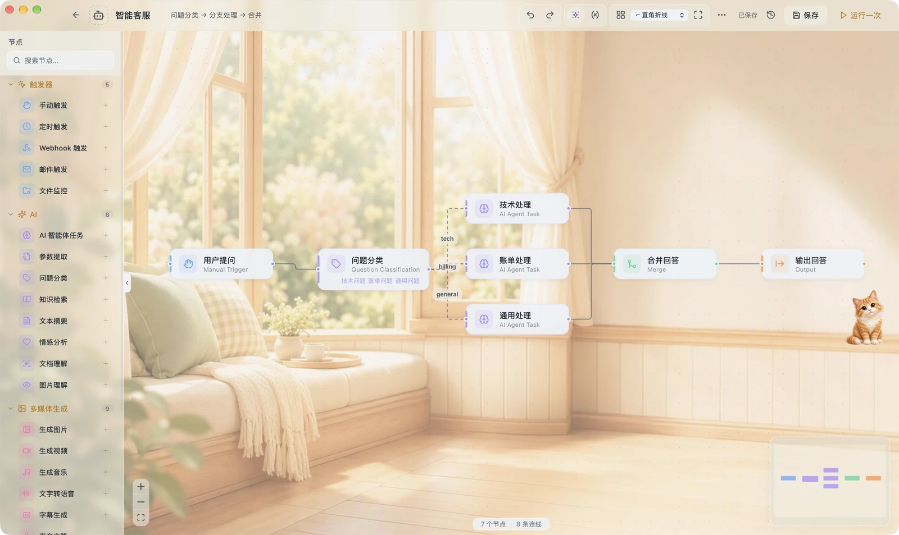

- **DAG 工作流**：43 类节点分属触发器、AI、多媒体生成、流程控制、数据处理与动作六类，支持条件分支、循环、子工作流嵌套（最大深度 5）。
- **执行与变量**：Kahn 拓扑排序后同层并行执行，`{{var}}` 插值、嵌套 JSON 路径与条件表达式求值，失败可按 abort / skip / fallback 策略处理。
- **暴露给模型**：工作流可注册为 Agent 工具（原生 / 延迟暴露），由模型在对话中直接调用；也支持定时触发与 `POST /webhook/{workflow_id}`。

### 6. 记忆、工作区与文件空间


- **精炼记忆**：`MEMORY.md`（事实与偏好）与 `USER.md`（用户画像）由 `MemoryManager` 统一读写并生成快照，注入系统提示。
- **Dreaming 入梦**：定时回顾历史会话，提炼新记忆进入待审批队列，用户或 Agent 审批后才落盘；记忆回顾会主动提出清理与合并建议。
- **日历与轨迹**：记忆页用日历 + 时间轴浏览「本月轨迹」，每日笔记可随时复盘，长期记忆按待审批队列逐条确认。
- **工作区**：`SOUL.md`、`AGENTS.md`、日记与生成物存放在 `~/.astro/workspace/`，项目级规则读项目根 `AGENTS.md` 与 `.astro/config.toml`。
- **文件空间**：`artifacts.db` 登记 Agent 产出与用户上传文件并做磁盘对账，`knowledge.db` 提供标题与正文的 FTS5 检索，按 doc / image / code / sheet / av / pdf_ppt 分类过滤。
- **上下文召回**：会话超过最近若干轮后，用 FTS5 从历史与知识库召回相关片段注入本轮上下文。

### 7. 用量洞察与可观测性

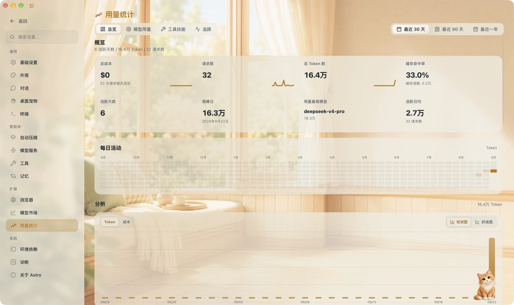

- **用量事件库**：`usage.db` 记录 tool / skill / mcp / cron / llm 五类事件，支持按月 / 季 / 年聚合、时间序列与多维排行。
- **成本估算**：结合官方定价快照与 OpenRouter 模型目录（24h 缓存）给出每次调用的 USD 估价，或标记 `included` / `unknown`。
- **调用链 Tracing**：按会话聚合 span 链（含输入输出、耗时与父子关系），并可导出 JSONL 供离线评测与 DSPy 使用。

调用链标签页把一次会话的执行过程铺开：调用次数与耗时、每个工具/模型的去向、token 与费用明细，以及原始输入输出。

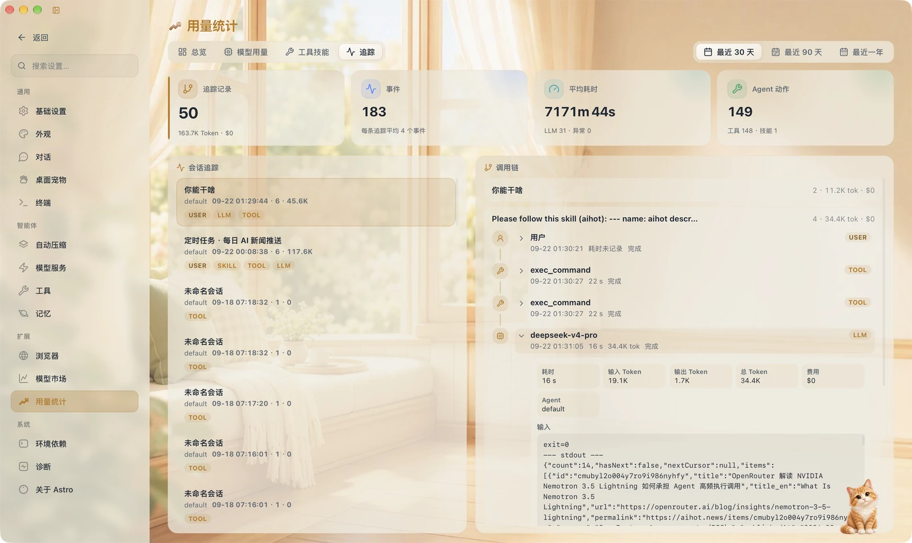

### 8. 内置浏览器与终端

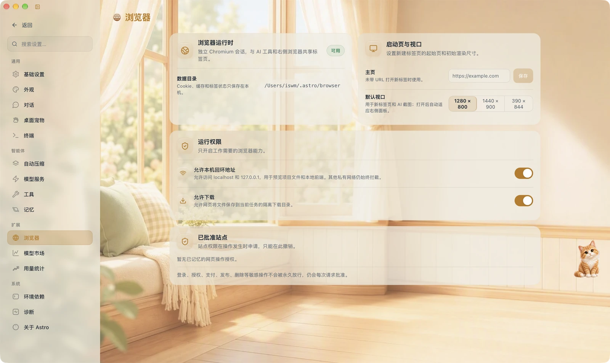

- **浏览器停靠**：右侧面板与 Agent 共享同一会话，Agent 可以打开、检查、点击并修改页面，用户可随时接管。
- **终端停靠**：PTY 终端与 Agent 前台命令共用沙箱策略，输出可被模型读取；后台任务与前台命令在权限与网络策略上分别处理。
- **浏览器权限**：独立 Chromium 会话、独立 profile 目录、默认窗口尺寸、本机回环地址与下载开关、已批准站点都在设置里集中管理。
- **结构化拒绝**：沙箱拒绝、网络策略拒绝与普通失败分类明确，拒绝不会自动升级为更宽的权限。

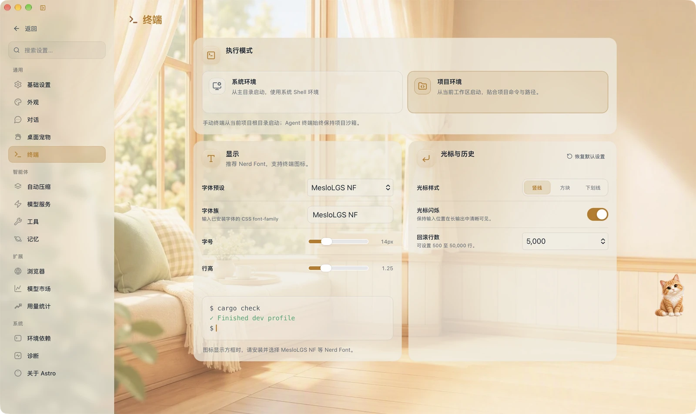

### 9. 外观、氛围与桌宠


- **外观系统**：材质强度、界面缩放、灵动配色、渐变外壳与壁纸组合成统一的视觉层；浅色 / 深色主题跟随系统或手动指定。
- **壁纸与氛围**：可上传图片或让 AI 生成壁纸，设置填充模式与内容保护强度，最近使用的背景随手切换；应用图标可在蓝色 / 深蓝 / 黑色 / 白色等变体间切换。


- **桌面宠物**：从照片或参考图生成 Q 版形象，支持 APNG 与混合渲染，可设置造型、位置与大小，并作为常驻窗口待在桌面上。
- **宠物即入口**：桌宠弹窗里可以处理审批与提问、查看任务进度，不必切回主窗口。
- **界面导览**：首次进入提供 8 个区域的轻量导览（输入框、模型、工具栏、侧栏、工作区、插件、外观、设置），可跳过、可重看，不修改任何配置。

### 10. 环境依赖、诊断与存储

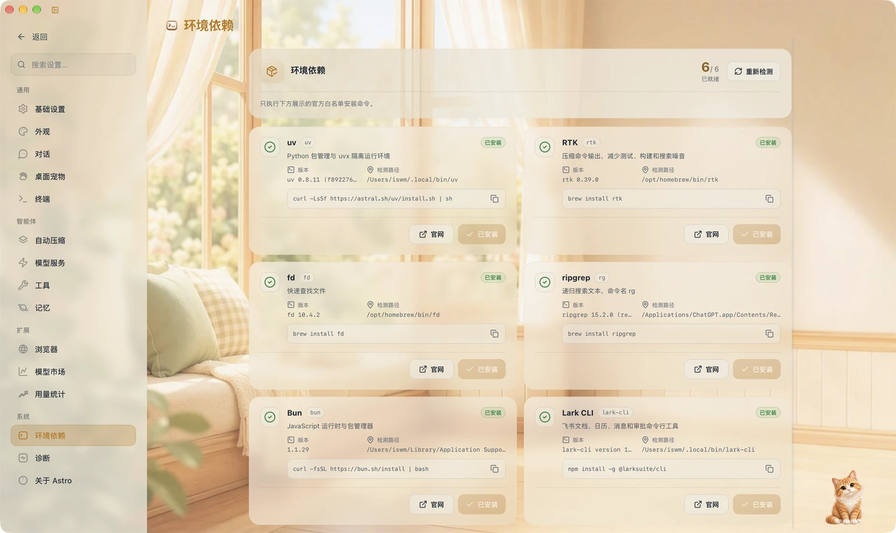

- **环境依赖**：uv / RTK / fd / ripgrep / Bun / Lark CLI 等外部工具链在设置里自检，缺失项给出复制即用的安装命令。
- **存储诊断**：检查本机数据目录、数据库与配置文件是否完整，识别新装、部分迁移与失效配置，并给出可执行的清理预览。
- **离线迁移**：`~/.astro` 的旧布局必须离线迁移，启动时发现旧目录或未完成迁移会拒绝初始化，避免生成空数据库。
- **安全边界**：派生进程进平台原生沙箱；开启受管网络代理后，前台 terminal 与 code_exec 的出站流量只走绑定到该次调用的 loopback 代理，域名按 allow / deny / ask 裁决并做 DNS 重绑定防护。
- **可审计**：沙箱与权限事件写入 append-only JSONL 审计日志，桌面端可查询。

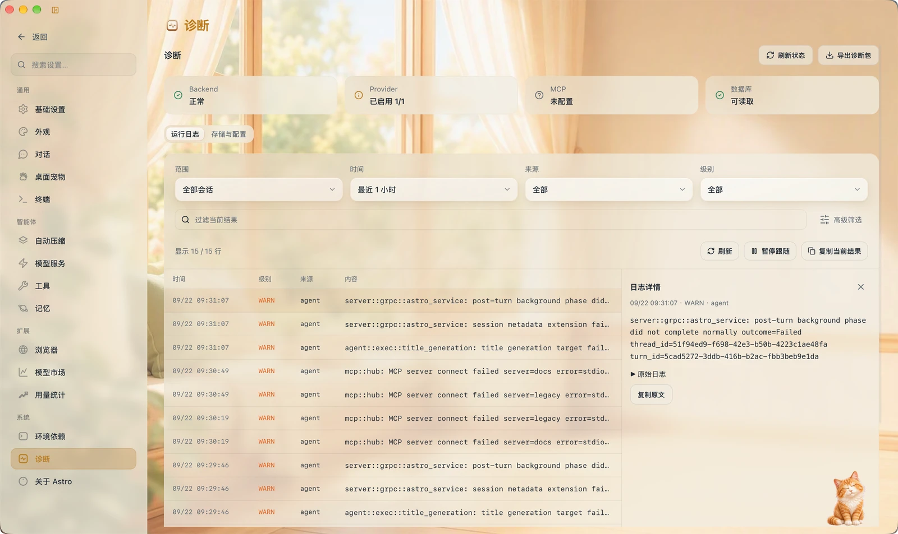

## 架构总览

```text
┌──────────────────────────────── Desktop (Tauri 2 + React/Vite) ───────────────────────────────┐
│  对话/任务侧栏 · 工作流编辑器 · 设置与洞察 · 桌宠 · 浏览器与终端停靠                          │
└───────────────▲───────────────────────────────────────────────────────▲───────────────────────┘
                │ Tauri commands                                  gRPC (tonic, 默认同进程)
┌───────────────┴───────────────────────────────────────────────────────┴───────────────────────┐
│                                    agent-server（AstroService）                                │
│  Durable Thread 管理 · 事件订阅 · Cron ticker · Workflow/Webhook 触发                          │
└───────────────▲───────────────────────────────────────────────────────────────────────────────┘
                │ Op / EventMsg / ResponseItem（agent-protocol）
┌───────────────┴───────────────────────────────────────────────────────────────────────────────┐
│                                      agent（Agent 运行时）                                     │
│  AstroThread → SessionTask → TurnContext → StepContext → Prompt → ResponsesRequest            │
│  工具路由 · 压缩 · HITL 审批 · Hooks · 子 Agent · 记忆注入 · 用量                             │
└──┬─────────────┬──────────────┬───────────────┬───────────────┬───────────────┬───────────────┘
   │             │              │               │               │               │
 providers      tools        skills/mcp      sandbox        rollout/session   memory
 模型适配      内置工具      扩展能力        权限与网络      历史与索引        记忆与学习
```

一次用户输入的完整链路：

```text
用户输入
  → AgentLoop::run_turn()            # 重置轮次预算、热加载工具与 MCP、写入 Session
  → build_conversation_context()     # 记忆 + FTS 召回 + 工作区规则
  → build_system_prompt()            # 稳定指令 / 动态上下文 / 原生工具 schema 三层
  → 多轮事件循环（step 级冻结 provider、model 与工具路由）
      ├─ 流式补全 → 累积原生 tool_call_delta
      ├─ 记录 assistant item → 执行工具 → 记录 output item
      └─ 无工具调用 → 最终答案
  → rollout（append-only 事实源） → SQLite 投影 → gRPC → Desktop
```

### Workspace 结构

```text
astro/
├── Cargo.toml              # Workspace 根（28 个 crate + 1 个桌面应用）
├── crates/                 # Rust crate（扁平 agent-* 命名）
└── apps/
    └── desktop/            # React + Vite UI + Tauri 2 壳 + Storybook 组件库
```

### 模块速查

| 分组 | Crate | 职责 |
| --- | --- | --- |
| 大脑 | `agent-core` (`agent`) | Agent 循环、流式多轮、工具分发、压缩、HITL、Hooks、Prompt 组装 |
| | `agent-providers` (`providers`) | 17 类模型与媒体 Provider、Responses-only Agent 入口、fallback 链 |
| | `agent-protocol` / `agent-types` | `Op` / `EventMsg` / `TurnItem` / `ResponseItem` 与跨 crate 共享类型 |
| | `agent-subagents` (`subagents`) | V2 Agent Threads：Graph、mailbox、状态与配额 |
| | `agent-memory` (`memory`) | MEMORY.md / USER.md 快照、Dreaming、待审批队列、决策日志 |
| | `agent-evolution` (`evolution`) | 技能候选生成、评审门禁、GEPA-lite 搜索与策展 |
| 工具 | `agent-tools` (`tools`) | 全部内置工具、注册表与分发、审批与 schema 清洗 |
| | `agent-a2ui` (`a2ui`) | 22 种生成式 UI 组件目录、模板与操作校验 |
| 通道 | `agent-server` (`server`) | gRPC 服务、Durable Thread、Cron/Workflow/Webhook |
| | `agent-proto` (`proto`) | 37 个 RPC、77 个 protobuf message 的契约 |
| 存储 | `agent-session` (`session`) | `state.db`（WAL + FTS5，schema v24）：会话、消息、检查点、附件 |
| | `agent-rollout` (`agent-rollout`) | append-only JSONL 历史（可恢复事件的事实源） |
| | `agent-artifacts` (`artifacts`) | 文件空间索引 `artifacts.db` 与知识检索 `knowledge.db` |
| | `agent-usage` (`usage`) | 用量事件、成本估算、调用链 Tracing 与 eval 导出 |
| | `agent-home` (`home`) | `~/.astro` 路径约定、日志、全局 TOML 与工具开关 |
| 自动化 | `agent-cron` (`cron`) | 定时任务定义、调度解析与运行记录 |
| | `agent-workflow` (`workflow`) | 43 类节点的 DAG 引擎与运行历史 |
| 扩展 | `agent-skills` (`skills`) | Skill 扫描、安装、注册表、更新与快照 |
| | `agent-mcp` (`mcp`) | MCP 客户端、连接池、工具发现与 OAuth |
| | `agent-hooks` (`hooks`) | Plugin / Command / Gateway / Shell 生命周期钩子 |
| | `agent-extensions` | Extension manifest、turn 冻结快照与下一轮 reconcile |
| 安全 | `agent-sandbox` (`sandbox`) | 三级权限模型、平台原生沙箱与审计 |
| | `agent-network-proxy` (`network-proxy`) | 受管 CONNECT 代理、域名裁决与 DNS 重绑定防护 |
| | `agent-delegate` (`worktree`) | 显式桌面任务的 git worktree 隔离 |
| 外壳 | `astro-agent` | Tauri 2 桌面壳：内嵌 backend、托盘、单实例与 32 个命令模块 |

## 快速开始

> 下面的构建与运行命令需要 Astro Agent 的完整源码，本仓库只包含文档。

### 环境要求

- [Rust](https://rustup.rs/)（edition 2021）
- Node.js 18+
- [Tauri 2 系统依赖](https://v2.tauri.app/start/prerequisites/)（macOS 需 Xcode CLT）

### 启动

```bash
# 安装前端依赖（首次）
cd apps/desktop && npm install

# 开发模式（Tauri + 内嵌 backend + 前端热更新）
npm run tauri dev

# 仅编译检查后端（最快）
cargo check

# 跑测试
cargo test
```

双击打包后的 App 即可使用：Tauri 壳会在同进程启动 gRPC backend（含 Cron），不需要另开终端。

### 只用命令行跑后端

```bash
# 终端 1：独立进程的 backend（默认 127.0.0.1:50051）
cargo run -p server

# 终端 2：关掉内嵌 backend，连接上面的进程
export ASTRO_EMBED_BACKEND=0
export ASTRO_GRPC_ADDR=127.0.0.1:50051
cd apps/desktop && npm run tauri dev
```

内嵌模式下未设置 `ASTRO_GRPC_ADDR` 时使用 `127.0.0.1:0`，由系统分配空闲端口，用户无感、也不与其它进程抢端口。`~/.astro/.env` 同样可以写 `ASTRO_EMBED_BACKEND` / `ASTRO_GRPC_ADDR`。

## 打包与发布

```bash
cd apps/desktop
npm run tauri build                 # 当前机器默认架构的全部 bundle
npm run tauri build -- --bundles dmg
npm run tauri build -- --bundles app
```

### macOS：ARM 与 x86_64

```bash
rustup target add aarch64-apple-darwin x86_64-apple-darwin

npm run tauri:build:arm            # Apple Silicon
npm run tauri:build:x64            # Intel
npm run tauri:build:universal      # Universal（ARM + x86 一份包）

npm run tauri:build:dmg:arm        # 对应 DMG 变体
npm run tauri:build:dmg:x64
npm run tauri:build:dmg:universal
```

产物按 target 区分：

```text
target/aarch64-apple-darwin/release/bundle/macos|dmg/...
target/x86_64-apple-darwin/release/bundle/macos|dmg/...
target/universal-apple-darwin/release/bundle/...
target/release/bundle/nsis|msi|appimage|deb/...     # Windows / Linux
```

图标与 DMG 资源在 `apps/desktop/src-tauri/icons/`；DMG 窗口尺寸与图标位置在 `tauri.conf.json` → `bundle.macOS.dmg`。默认不设自定义背景（曾引用不存在的 `dmg-background.png` 会让打包直接失败），需要品牌背景时放入 660×372 的 PNG 并补上 `"background"` 字段。

默认配置不生成 updater 签名产物，因此常规打包不需要私钥；发布通道使用 `src-tauri/tauri.release.conf.json` 打开 `createUpdaterArtifacts`，此时必须提供 `TAURI_SIGNING_PRIVATE_KEY` 与 `TAURI_SIGNING_PRIVATE_KEY_PASSWORD`。Windows / Linux 的 ARM 包需要在对应系统或 CI runner 上构建，本机 Mac 无法交叉产出。

### CI 多平台打包

| Workflow | 触发 | 作用 |
| --- | --- | --- |
| `build-tauri` | PR（相关路径变更）/ 手动 | macOS arm64 + x86_64、Linux x64、Windows x64，上传 Artifacts |
| `release-tauri` | 手动 / `release` 分支 / `v*` 标签 | 同上，写入**草稿** GitHub Release |

- Tauri 需要在对应系统上原生构建，无法在一台机器上交叉打出全部 OS 安装包。
- 首次使用 Release 前，在仓库 **Settings → Actions → General → Workflow permissions** 勾选 **Read and write permissions**。
- 推送到 GitHub 后，在 Actions 页点 **Run workflow** 即可试跑。

## 运行形态

### 托盘常驻

关闭主窗口会隐藏到系统托盘，内嵌 backend 与 Cron 继续运行；左键点托盘图标恢复窗口，「退出 Astro」才会真正结束进程。偏好设置里的界面语言会同步到原生菜单栏与托盘文案。

### 单实例

再次打开 App 不会起第二套进程或 backend，而是把已有窗口拉到前台（Windows / Linux 走 single-instance 插件，macOS 另支持 Dock 再点与 Reopen）。

### Realtime 语音会话

Realtime 是独立 crate，并通过统一 Thread 协议接入桌面端：默认 WebRTC（`oai-events` data channel + 媒体 track），同时支持 WebSocket 兼容传输、SDP offer/answer 与 ExistingCall sideband 接管。Azure OpenAI 使用 GA `/openai/v1`，WebRTC 走 `client_secrets` 临时凭据。完整 transcript 与会话边界以 `RealtimeItem` 持久化，原始音频不落盘；语音请求可通过 Codex handoff 转成普通 Agent turn。

### 结构化异步提问

Agent 在回合继续运行时可以调用 `request_user_input_async` 发出一个或多个自包含问题（可带建议选项），回答作为普通 user input 进入当前 turn。

### Durable Thread 设置

`ThreadSettingsApplied` 把 provider / backend / model / reasoning 写入 rollout：热 Session 读当前设置，冷 Thread 读最后一条持久设置，`start / resume / fork / list / history` 使用同一投影。用量以 `TokenUsageRecord { latest, cumulative, compaction_response_id }` 保存，resume 恢复累计基线，fork 不继承父线程累计值。

## 本机数据目录

```text
~/.astro/
  config.toml          # 唯一全局配置入口（旧 YAML 已退役）
  .env                 # 凭证环境入口
  agents/              # *.toml 自定义 Agent；active.json 当前专家标识
  models/              # cache/ 模型元数据与定价
  tools/               # 工具领域运行数据（开关在 config.toml）
  skills/              # 技能包、origins.json、lock.json、backups/
  sessions/
    state.db           # ResponseItem、会话、FTS5、线程检查点与附件（schema v24）
    rollouts/          # append-only 事件事实源
    tool_spills/       # 大工具输出落盘
    subagents/subagents-v2.db   # Agent Graph、mailbox、状态事件
  artifacts/           # artifacts.db、knowledge.db、uploads/
  usage/               # usage.db 与 agents/{id}/stats.json
  automation/
    cron/              # jobs.json、cron_v1.db、output/
    workflows/         # workflows.json、workflow.db、schedule_state.json
  memory/              # dreaming.json、pending/
  evolution/           # 学习、决策、进化记录与 dspy/.venv
  security/            # audit/、locks/
  browser/             # 浏览器配置与登录 profile（不是可随意删除的缓存）
  ui/                  # onboarding.json、图标、壁纸、主题、桌宠
  logs/                # 运行日志
  workspace/           # SOUL.md、USER.md、MEMORY.md、AGENTS.md、日记与生成物
  backups/             # 离线迁移备份与清单
```

路径统一由 `home::layout` 提供，业务模块不自行拼接领域目录。旧布局必须离线迁移；启动时发现旧目录或未完成的迁移会拒绝初始化，避免生成空的平行数据库。详见 [本机数据的领域布局](docs/home-layout.md) 与 [全局设置](docs/global-settings.md)。

## README 截图如何维护

`docs/images/` 下的图片都是从运行中的 App 窗口截取的真机画面，文件名即模块名：

| 文件 | 对应界面 |
| --- | --- |
| `app-overview.webp` | 主界面：欢迎页 + 导航侧栏 + 终端停靠 |
| `chat-answer.webp` / `context-usage.webp` | 对话长回答 / 上下文占用浮层 |
| `chat-settings.webp` | 对话设置：显示详细程度、面板显示、忙碌时发送模式 |
| `model-picker.webp` / `providers.webp` / `model-market.webp` | 模型选择器 / Provider 配置 / 模型市场 |
| `tools.webp` / `skills.webp` / `mcp.webp` | 内置工具 / 本机 Skills / MCP 市场 |
| `cron.webp` / `workflow.webp` | 定时任务与运行详情 / 可视化工作流 |
| `memory.webp` | 记忆、日历与每日笔记 |
| `usage.webp` / `trace.webp` | 用量统计 / 调用链追踪 |
| `browser.webp` / `terminal.webp` | 浏览器设置 / 终端设置 |
| `appearance.webp` / `desktop-pet.webp` | 外观与壁纸 / 桌面宠物 |
| `environment.webp` / `diagnostics.webp` | 环境依赖 / 诊断与错误详情 |

更新流程：

```bash
# 1. 启动 App（或用打包好的 .app 窗口截图）
cd apps/desktop && npm run tauri dev

# 2. 把原图放进 docs/images/raw/（该目录已 gitignore，不会进仓库）

# 3. 转成宽度 1600 的 WebP 覆盖同名文件
cwebp -q 90 -alpha_q 100 docs/images/raw/<原图>.png -o docs/images/tools.webp
```

需要不带任何本机数据的组件级截图时，可以改用 `apps/desktop` 的 Storybook（`npm run storybook`，真实组件渲染、只替换原生 transport）。

## 文档索引

| 入口 | 内容 |
| --- | --- |
| [docs/README.md](docs/README.md) | 文档总目录（按软件工程阶段组织） |
| [架构总览](docs/03-系统设计阶段/01-架构设计/01-架构总览.md) | 系统分层、模块依赖与数据流 |
| [Responses 原生运行时](docs/03-系统设计阶段/01-架构设计/12-Responses原生Agent运行时架构.md) | Responses-only 契约与原生历史 |
| [Agent Harness 总体架构](docs/03-系统设计阶段/01-架构设计/11-Agent-Harness总体架构.md) | Agent = Model + Harness 基线 |
| [Realtime 子系统](docs/03-系统设计阶段/02-核心功能模块/11-Realtime子系统.md) | 运输、版本、handoff 与恢复契约 |
| [MCP 集成](docs/03-系统设计阶段/02-核心功能模块/03-MCP集成.md) | Server 配置、工具发现与命名空间 |
| [Skills 系统](docs/03-系统设计阶段/02-核心功能模块/04-Skills系统.md) | Skill 生命周期与工具开关 |
| [Subagent 系统](docs/03-系统设计阶段/02-核心功能模块/05-Subagent系统设计.md) | Agent Threads、配额与恢复 |
| [记忆系统](docs/03-系统设计阶段/02-核心功能模块/10-记忆系统.md) | 精炼记忆、入梦与审批 |
| [Hook 运行契约](docs/03-系统设计阶段/03-基础设施/09-Hook运行契约.md) | 三总线 Hook 事件与返回值 |
| [安全边界](docs/03-系统设计阶段/03-基础设施/06-安全边界.md) | 沙箱、审批与审计 |
| [Extension Manifest](docs/03-系统设计阶段/09-生态扩展/03-Extension-Manifest.md) | 扩展清单、快照与 reconcile |
| [本机数据布局](docs/home-layout.md) | `~/.astro` 领域目录与迁移边界 |
| [全局设置](docs/global-settings.md) | `config.toml` 收口与显式迁移 |
| [存储诊断](docs/storage-diagnostics.md) | 数据目录检查与清理预览 |
| [主界面导览](docs/interface-tour.md) | 界面导览行为与保存边界 |
| [图像生成模型](docs/image-generation-models.md) / [Azure gpt-image-2](docs/azure/azure-gpt-image-2.md) | 图像生成配置与实现 |

## 常用命令

```bash
# 后端
cargo fmt --all                      # 格式化
cargo fmt --all -- --check           # 仅检查格式
cargo check                          # Workspace 检查
cargo clippy --all-targets           # Lint
cargo test                           # 全量测试
cargo test -p agent                  # 单 crate 测试
cargo test -p agent <test_name> -- --nocapture

# 前端
cd apps/desktop
npm run build                        # tsc + vite build + 样式层级检查
npx tsc --noEmit                     # 仅类型检查
npm run test                         # 前端单测
npm run test:visual                  # Playwright + Storybook 视觉回归
npm run storybook                    # 组件开发服务器（:6006）
npm run format:check                 # Biome 格式检查
npm run lint:css                     # Stylelint
```

## 许可证

私有项目，未声明开源许可。
