# ER 关系图

> 阶段：系统设计 | 状态：定稿 | 说明：Mermaid ER 图、聚合根、工作区隔离

## 一、Mermaid ER 图

涵盖当前 Schema 的 22 个实体（21 张表 + embeddings 虚拟表）。另有 FTS5 虚拟表 messages_fts、chunks_fts 及 1 个视图（slow_tool_alerts）未在 ER 图中展示，完整 DDL 见 01-Schema设计.md。

```mermaid
erDiagram
    workspaces {
        TEXT id PK
        TEXT name
        TEXT root_path
        TEXT config_json
        INTEGER is_active
        INTEGER created_at
        INTEGER updated_at
    }
    conversations {
        TEXT id PK
        TEXT workspace_id FK
        TEXT title
        TEXT model
        TEXT system_prompt
        INTEGER token_input
        INTEGER token_output
        TEXT status
        INTEGER is_pinned
        TEXT parent_conversation_id FK
        TEXT branch_point_message_id FK
        INTEGER created_at
        INTEGER updated_at
    }
    messages {
        TEXT id PK
        TEXT conversation_id FK
        TEXT role
        TEXT content
        TEXT reasoning_content
        TEXT tool_call_id
        TEXT tool_name
        INTEGER token_count
        INTEGER latency_ms
        INTEGER is_pinned
        INTEGER created_at
    }
    memory_entries {
        TEXT id PK
        TEXT workspace_id FK
        TEXT category
        TEXT key
        TEXT value
        TEXT source
        REAL importance
        INTEGER half_life_days
        INTEGER retrieval_count
        INTEGER last_retrieved_at
        INTEGER valid_from
        INTEGER valid_to
        TEXT superseded_by FK
        INTEGER expires_at
        INTEGER distilled_at
        INTEGER created_at
    }
    skills {
        TEXT id PK
        TEXT workspace_id FK
        TEXT name
        TEXT description
        TEXT trigger_tags
        TEXT entry_file
        INTEGER is_enabled
        INTEGER version
        TEXT content_hash
        TEXT status
        TEXT origin
        TEXT parent_id FK
        INTEGER created_at
        INTEGER updated_at
    }
    prompt_versions {
        TEXT id PK
        TEXT skill_id FK
        TEXT name
        TEXT content
        TEXT variables
        INTEGER version
        INTEGER is_current
        TEXT author
        TEXT change_note
        INTEGER created_at
    }
    cost_records {
        TEXT id PK
        TEXT workspace_id FK
        TEXT conversation_id FK
        TEXT model
        INTEGER input_tokens
        INTEGER output_tokens
        REAL cost_usd
        INTEGER recorded_at
    }
    audit_logs {
        TEXT id PK
        TEXT workspace_id FK
        TEXT session_id
        TEXT actor
        TEXT action
        TEXT tool_name
        TEXT tool_source
        TEXT risk_level
        TEXT status
        INTEGER duration_ms
        TEXT approved_by
        TEXT detail_json
        INTEGER created_at
    }
    evolution_log {
        TEXT id PK
        TEXT workspace_id FK
        TEXT action_type
        TEXT payload
        TEXT status
        TEXT approved_by
        INTEGER created_at
    }
    task_traces {
        TEXT id PK
        TEXT workspace_id FK
        TEXT conversation_id FK
        TEXT parent_id FK
        TEXT status
        INTEGER depth
        TEXT input_json
        TEXT checkpoint_json
        INTEGER finished_at
        INTEGER created_at
        INTEGER updated_at
    }
    media_tasks {
        TEXT task_id PK
        TEXT workspace_id FK
        TEXT modality
        TEXT status
        INTEGER progress_pct
        TEXT file_paths
        TEXT error
        TEXT provider
        TEXT model
        INTEGER created_at
        INTEGER finished_at
    }
    ai_artifacts {
        TEXT id PK
        TEXT conversation_id FK
        TEXT workspace_id FK
        TEXT artifact_type
        TEXT title
        TEXT file_path
        TEXT mime_type
        INTEGER size_bytes
        INTEGER created_at
    }
    embeddings {
        INTEGER rowid PK
        FLOAT[] embedding
        TEXT source_type
        TEXT source_id
        TEXT workspace_id
    }
    tags {
        TEXT id PK
        TEXT workspace_id FK
        TEXT name
        TEXT color
        INTEGER created_at
    }
    conversation_tags {
        TEXT conversation_id FK
        TEXT tag_id FK
    }
    prompt_snippets {
        TEXT id PK
        TEXT workspace_id FK
        TEXT title
        TEXT content
        TEXT variables
        TEXT tags
        INTEGER use_count
        INTEGER created_at
        INTEGER updated_at
    }
    scheduled_tasks {
        TEXT id PK
        TEXT workspace_id FK
        TEXT name
        TEXT skill_name
        TEXT skill_input
        TEXT cron_expr
        INTEGER is_enabled
        INTEGER last_run_at
        INTEGER next_run_at
        TEXT last_status
        TEXT last_error
        INTEGER created_at
    }
    budget_configs {
        TEXT id PK
        TEXT workspace_id FK
        TEXT scope
        REAL daily_limit_usd
        REAL monthly_limit_usd
        INTEGER warn_at_pct
        INTEGER updated_at
    }
    daily_cost_summary {
        TEXT workspace_id PK
        TEXT provider PK
        TEXT model PK
        TEXT day PK
        INTEGER total_input
        INTEGER total_output
        REAL total_cost
        INTEGER call_count
        INTEGER updated_at
    }
    knowledge_sources {
        TEXT id PK
        TEXT workspace_id FK
        TEXT title
        TEXT uri
        TEXT source_type
        TEXT status
        TEXT content_hash
        INTEGER chunk_count
        TEXT error_message
        INTEGER created_at
        INTEGER updated_at
    }
    knowledge_chunks {
        TEXT id PK
        TEXT source_id FK
        TEXT workspace_id FK
        TEXT content
        TEXT heading_path
        INTEGER token_count
        BLOB embedding
        TEXT metadata_json
        INTEGER chunk_index
        INTEGER created_at
    }
    trace_steps {
        TEXT id PK
        TEXT trace_id FK
        TEXT step_type
        TEXT tool_name
        TEXT input_json
        TEXT output_json
        INTEGER started_at
        INTEGER finished_at
    }

    workspaces      ||--o{ conversations   : "workspace_id"
    workspaces      ||--o{ memory_entries  : "workspace_id"
    workspaces      ||--o{ cost_records    : "workspace_id"
    workspaces      ||--o{ task_traces     : "workspace_id"
    workspaces      ||--o{ skills          : "workspace_id"
    workspaces      ||--o{ media_tasks     : "workspace_id"
    workspaces      ||--o{ ai_artifacts    : "workspace_id"
    workspaces      ||--o{ evolution_log   : "workspace_id"
    workspaces      ||--o{ audit_logs      : "workspace_id"
    workspaces      ||--o{ tags            : "拥有"
    workspaces      ||--o{ prompt_snippets : "拥有"
    workspaces      ||--o{ scheduled_tasks : "拥有"
    workspaces      ||--o{ budget_configs  : "拥有"

    conversations   ||--o{ messages        : "conversation_id"
    conversations   ||--o{ cost_records    : "conversation_id"
    conversations   ||--o{ ai_artifacts    : "conversation_id"
    conversations   ||--o{ task_traces     : "conversation_id"
    conversations   }o--o{ tags            : "通过 conversation_tags"
    conversations   }o--o| conversations   : "parent_conversation_id（分支）"

    skills          ||--o{ prompt_versions : "skill_id"
    skills          }o--o| skills          : "parent_id（版本链）"

    task_traces     }o--o| task_traces     : "parent_id（子任务树）"

    memory_entries  }o--o| memory_entries  : "superseded_by（版本链）"

    workspaces      ||--o{ knowledge_sources : "workspace_id"
    knowledge_sources ||--o{ knowledge_chunks : "source_id"
    task_traces     ||--o{ trace_steps      : "trace_id"
```

---

## 二、关系类型说明

| 关系 | 类型 | 删除策略 |
| --- | --- | --- |
| workspaces → conversations | 1:N | CASCADE |
| workspaces → memory_entries | 1:N | CASCADE |
| workspaces → cost_records | 1:N | CASCADE |
| workspaces → task_traces | 1:N | CASCADE |
| workspaces → skills | 1:N（workspace_id 为 NULL 时全局共享） | CASCADE |
| workspaces → media_tasks | 1:N | CASCADE |
| workspaces → ai_artifacts | 1:N | CASCADE |
| workspaces → evolution_log | 1:N | CASCADE |
| workspaces → audit_logs | 1:N | SET NULL（保留审计历史） |
| conversations → messages | 1:N | CASCADE |
| conversations → cost_records | 1:N | SET NULL |
| conversations → ai_artifacts | 1:N | SET NULL |
| conversations → task_traces | 1:N | CASCADE |
| workspaces → knowledge_sources | 1:N | CASCADE |
| knowledge_sources → knowledge_chunks | 1:N | CASCADE |
| task_traces → trace_steps | 1:N | CASCADE |
| skills → prompt_versions | 1:N | SET NULL |
| skills → skills（parent_id） | 自引用版本链 | — |
| task_traces → task_traces（parent_id） | 自引用子任务树 | CASCADE |
| workspaces → tags | 1:N | CASCADE |
| workspaces → prompt_snippets | 1:N（workspace_id 为 NULL 时全局共享） | CASCADE |
| workspaces → scheduled_tasks | 1:N | CASCADE |
| workspaces → budget_configs | 1:N（workspace_id 为 NULL 时全局配置） | CASCADE |
| conversations ↔ tags（conversation_tags） | M:N（中间表 conversation_tags） | CASCADE |
| conversations → conversations（parent_conversation_id） | 自引用分支链 | SET NULL |
| memory_entries → memory_entries（superseded_by） | 自引用软替换链 | — |

---

## 三、各实体核心属性

| 实体 | 分区键 | 关键字段 |
| --- | --- | --- |
| workspaces | — | root_path、config_json、is_active |
| conversations | workspace_id | model、system_prompt、status、token_input/output、is_pinned、parent_conversation_id |
| messages | conversation_id | role、content、reasoning_content、tool_call_id、is_pinned |
| memory_entries | workspace_id | category、key/value、half_life_days、valid_from/valid_to、superseded_by |
| skills | workspace_id | name、version、content_hash、status、origin、parent_id |
| prompt_versions | skill_id | version、is_current、content_hash |
| cost_records | workspace_id | model、input_tokens/output_tokens、cost_usd |
| audit_logs | workspace_id | actor、action、tool_name、risk_level、status |
| evolution_log | workspace_id | action_type、status、approved_by |
| task_traces | workspace_id | parent_id（子任务树）、status、started_at/finished_at |
| media_tasks | workspace_id | modality、status、file_paths（JSON）、provider/model |
| ai_artifacts | workspace_id | artifact_type、file_path、mime_type |
| tags | workspace_id | name、color |
| conversation_tags | — | conversation_id、tag_id（联合主键） |
| prompt_snippets | workspace_id | title、content、variables（JSON）、use_count |
| scheduled_tasks | workspace_id | skill_name、cron_expr、is_enabled、next_run_at |
| budget_configs | workspace_id | scope、daily_limit_usd、monthly_limit_usd、warn_at_pct |
| embeddings | workspace_id（辅助列） | embedding FLOAT[1536]、source_id（关联 memory_entries） |

---

## 四、聚合根识别

**聚合根**（独立生命周期，外部直接引用）：

| 聚合根 | 说明 |
| --- | --- |
| workspaces | 顶层边界，所有业务数据通过 workspace_id 挂载 |
| conversations | 对话生命周期独立，关联消息、成本、产物 |
| skills | Skill 版本链根（按 name 聚合，parent_id 自引用） |
| task_traces | Agent 任务执行记录，进化引擎的原材料 |
| media_tasks | 异步多媒体生成任务（独立轮询生命周期） |
| ai_artifacts | AI 产物归档（跨对话/工作区归属） |
| evolution_log | 跨聚合根的进化审计，独立生命周期 |

**值对象**（依附于聚合根）：

| 值对象 | 归属聚合根 |
| --- | --- |
| messages | conversations |
| prompt_versions | skills |
| cost_records | conversations / workspaces |
| audit_logs | workspaces |
| memory_entries | workspaces（含版本链） |
| tags | workspaces |
| conversation_tags | conversations / tags |
| prompt_snippets | workspaces |
| scheduled_tasks | workspaces |
| budget_configs | workspaces |
| embeddings | memory_entries（via rowid） |

---

## 五、跨工作区隔离设计

**强隔离**（带 workspace_id 外键，查询必须携带 `WHERE workspace_id = ?`）：

conversations、memory_entries、cost_records、task_traces、media_tasks、ai_artifacts、evolution_log、audit_logs、tags、scheduled_tasks

**间接隔离**：messages 经 conversation_id、cost_records 经 conversation_id、conversation_tags 经 conversation_id 间接归属工作区，应用层须 JOIN 至聚合根确认归属。

**全局共享**：skills 的 workspace_id 为 NULL 时表示内置全局 Skill，通过 is_enabled 控制各工作区激活状态；prompt_versions 随 skills 继承归属。prompt_snippets 的 workspace_id 为 NULL 时表示全局片段；budget_configs 的 workspace_id 为 NULL 时表示全局预算配置。

**向量命名空间**：embeddings 虚拟表（sqlite-vec vec0）以 workspace_id 辅助列做逻辑隔离，KNN 查询加 `WHERE workspace_id = ?`，禁止跨工作区向量比较。

**记忆版本隔离**：memory_entries 同一 key 同一时刻只有一条 `valid_to IS NULL` 的活跃版本（partial unique index 保证），旧版本软删除后对 Agent 不可见，但可在调试面板追溯完整变更历史。
