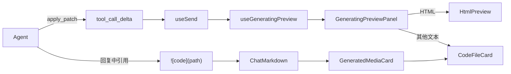

# 代码文件卡片与实时生成预览实现说明

本文记录 Astro 聊天中代码/文本文件卡片和生成中实时预览侧栏的实现约定。内容以当前仓库代码为准。

## 1. 功能概览

该功能包含两条相互衔接的展示路径：

1. Agent 写入代码或文本文件后，在回复正文使用 `` 引用文件。前端将其渲染为代码卡片，并按文件后缀启用 CodeMirror 语法高亮。
2. Agent 调用 `apply_patch` 写入文件期间，前端从流式 `tool_call_delta` 中提取尚未完整闭合的 `path` 和 `content`，自动打开聊天右侧栏的”预览”页签，实时显示代码或 HTML。



## 2. 回复标记约定

系统提示在 `crates/agent-core/src/prompt/prompt_builder.rs` 中要求：

```markdown

```

约束如下：

- `path` 使用 Agent 工作区相对路径，不使用绝对路径。
- `.py`、`.rs`、`.c`、`.ts`、`.json`、`.md` 等代码或文本文件使用 `code` 标记。
- 文件已经落盘后，不再把全文重复粘贴到回复正文，避免重复占用会话上下文。
- 图片、音频、视频和 HTML 继续使用 `![image]`、`![audio]`、`![video]`、`![html]`。

## 3. 代码文件卡片

### 3.1 类型识别

`apps/desktop/src/lib/media/parseGeneratedMedia.ts` 定义 `GeneratedMediaKind`，其中包含 `code`，并通过 `CODE_EXT` 和 `isCodePath()` 判断代码/文本文件。

`apps/desktop/src/components/chat/ChatMarkdown.tsx` 的识别顺序是：

1. Markdown `alt` 明确为 `code` 时直接按代码处理。
2. 未指定明确类型时，根据路径后缀判断音频、视频、HTML 或代码。
3. 都不匹配时回落为图片。

### 3.2 渲染

`apps/desktop/src/components/media/GeneratedMediaCard.tsx` 在 `kind === "code"` 时渲染 `CodeFileCard`。

`apps/desktop/src/components/media/CodeFileCard.tsx` 支持两种内容来源：

- `path`：通过 Tauri `read_file` 读取已经落盘的文件。
- `source`：直接渲染内存中的文本，供生成中实时预览复用。

组件调用 `languageForFilename()` 根据后缀加载 CodeMirror 语言扩展，并使用当前主题对应的 CodeMirror 主题。编辑器为只读模式，保留行号、换行和括号匹配。

### 3.3 文件操作

代码卡片复用 `MediaToolbar`：

- 复制：代码文件优先读取文件正文并复制文本；失败时回落为文件或路径复制。
- 下载：复制本地文件到系统下载目录。
- 引用：将文件作为聊天附件加入输入框。
- 预览：可在统一媒体预览弹窗中打开代码、HTML 和受支持文档。

对应实现位于：

- `apps/desktop/src/components/media/MediaToolbar.tsx`
- `apps/desktop/src/components/media/MediaPreviewModal.tsx`
- `apps/desktop/src/lib/media/mediaActions.ts`

## 4. 生成中实时预览

### 4.1 数据来源

`apply_patch` 最终仍然一次性写入磁盘。实时预览不依赖文件系统监听，而是使用模型生成工具参数时产生的 `tool_call_delta`。

`apps/desktop/src/hooks/chat/useSend.ts` 同时执行两项处理：

- 继续把工具参数增量交给聊天活动卡。
- 把同一增量交给 `generatingPreviewApi.onToolDelta()`。

工具完成时调用 `onToolCall()`，流结束或报错时调用 `onStreamEnd()`。

### 4.2 部分 JSON 解析

`apps/desktop/src/lib/chat/parsePartialFileWrite.ts` 专门处理不完整的工具参数 JSON。

解析策略：

1. 优先调用 `JSON.parse()` 处理已经完整的参数。
2. 解析失败时扫描 `path`、`operation` 和 `content` 字符串字段。
3. 扫描器支持换行、制表符、引号、反斜杠和 Unicode 等 JSON 转义。
4. `content` 尚未闭合时仍返回当前已经到达的文本，并以 `complete: false` 标记。

该解析器只负责提取字段，不执行文件操作。

### 4.3 状态与节流

`apps/desktop/src/hooks/chat/useGeneratingPreview.ts` 维护以下状态：

```ts
type GeneratingPreview = {
  toolKey: string;
  path: string | null;
  filename: string | null;
  content: string;
  kind: "html" | "code";
  status: "streaming" | "done";
};
```

关键行为：

- 仅处理工具名为空或为 `apply_patch` 的增量。
- 仅当参数中已经出现 `content` 字段时启动预览。
- `.html` 和 `.htm` 按 HTML 预览，其他内容按代码预览。
- 首次获得可预览内容时自动打开聊天右侧栏并切换到“预览”页签。
- 状态更新按约 90 ms 节流，降低 React 重渲染和 iframe `srcDoc` 重建频率。
- 工具完成时使用完整的 `arguments_json` 覆盖流式内容，并将状态改为 `done`。

### 4.4 侧栏渲染

`apps/desktop/src/components/chat/ChatRightPanel.tsx` 增加 `preview` 页签。

`apps/desktop/src/components/chat/GeneratingPreviewPanel.tsx` 根据内容类型选择：

- HTML：`HtmlPreview source={content}`，使用沙箱 iframe 的 `srcDoc` 实时渲染。
- 其他代码/文本：`CodeFileCard source={content}`，按文件名后缀高亮。

面板顶部显示文件名、生成状态和复制按钮。没有活动文件时显示空状态提示。

## 5. 结构化媒体兼容

后端可能把 `apply_patch` 产物作为 `kind: "file"` 返回。`useSend.ts` 会按扩展名将其归类为：

- `html`
- `image`
- `video`
- `audio`
- `code`

这保证工具完成后的活动卡与生成中的预览使用一致的展示类型。

## 6. 关键文件

- `crates/agent-core/src/prompt/prompt_builder.rs`：`` 输出约定。
- `apps/desktop/src/lib/media/parseGeneratedMedia.ts`：媒体类型与代码后缀识别。
- `apps/desktop/src/components/chat/ChatMarkdown.tsx`：Markdown 标记解析。
- `apps/desktop/src/components/media/GeneratedMediaCard.tsx`：生成结果卡片分发。
- `apps/desktop/src/components/media/CodeFileCard.tsx`：代码/文本只读预览。
- `apps/desktop/src/lib/chat/parsePartialFileWrite.ts`：不完整 JSON 容错解析。
- `apps/desktop/src/hooks/chat/useGeneratingPreview.ts`：实时预览状态与节流。
- `apps/desktop/src/hooks/chat/useSend.ts`：聊天流事件接入。
- `apps/desktop/src/hooks/chat/useChatSession.ts`：侧栏状态接线。
- `apps/desktop/src/components/chat/ChatRightPanel.tsx`：预览页签。
- `apps/desktop/src/components/chat/GeneratingPreviewPanel.tsx`：实时预览界面。
- `apps/desktop/src/components/media/HtmlPreview.tsx`：沙箱 HTML 预览。

## 7. 已知边界

- 实时预览依赖 Provider 返回工具参数增量；若 Provider 只返回最终完整工具调用，侧栏会在完成前没有内容。
- 当前实时内容来自工具参数，而不是磁盘写入进度，因此不表示文件已经写入成功。
- 当前实现只实时展示 `apply_patch` 中带 `content` 的调用（新建文件），纯 patch 修改不会启动预览。
- HTML 每次更新都会替换 iframe `srcDoc`，页面内部运行状态可能重置；90 ms 节流只能降低频率，不能保持 iframe 状态。
- 同一时刻只展示最近一次激活的文件写入；并发多文件写入没有多标签切换界面。

## 8. 验证

构建检查：

```bash
cd apps/desktop
npx tsc --noEmit
npx vite build

cd ../..
cargo check -p agent
```

手工验证：

1. 让 Agent 写入一个 `.py` 或 `.rs` 文件，并在回复中输出 ``。
2. 确认代码卡片显示正确语言高亮，并验证复制、下载、引用和预览。
3. 让 Agent 使用 `apply_patch` 生成 HTML 文件。
4. 确认右侧栏自动切换到“预览”，生成过程中 iframe 持续更新，完成后状态变为“已完成”。
5. 分别验证含引号、换行、反斜杠和 Unicode 的内容没有被部分 JSON 解析器破坏。
